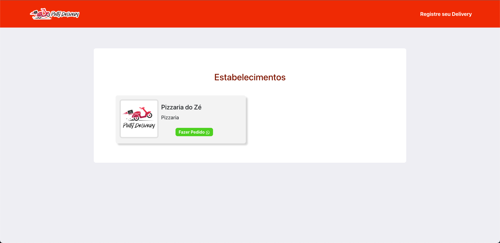
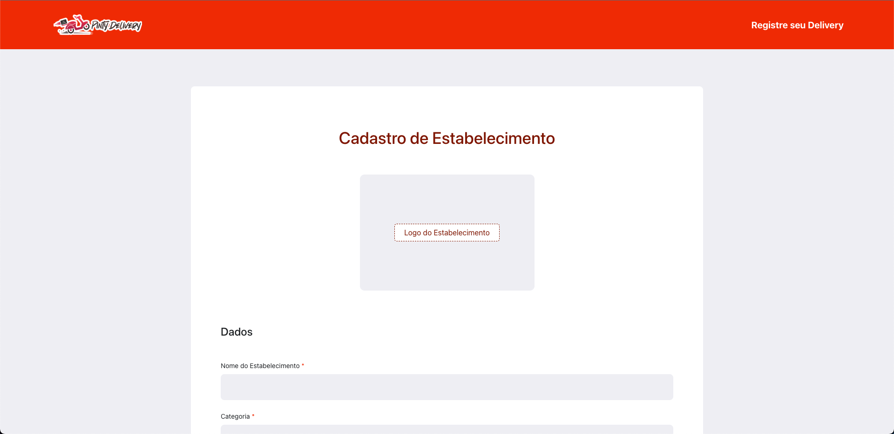

<div align="center">
 

 <p>Plataforma com Listagem de Deliveries</p>
</div>

<p align="center">
 <a href="#sobre">Sobre</a> •
 <a href="#como-executar">Como executar</a> •
 <a href="#tecnologias">Tecnologias</a>
</p>

## Sobre

O Pinty Delivery foi um projeto pessoal desenvolvido em 2020 com o objetivo de praticar e aprender mais sobre o desenvolvimento de aplicações web, além de criar uma plataforma útil para o dia a dia e para o momento de pandemia.

A ideia era criar uma plataforma com a listagem de todos os estabelecimentos da cidade de Pintadas na Bahia, onde o usuário poderia visualizar os estabelecimentos e entrar em contato com eles via WhatsApp para realizar pedidos de delivery.

<p align="center">
  
  
</p>

## Como executar

Para executar o projeto, você precisará rodar a api e o frontend separadamente. O projeto foi desenvolvido utilizando o Node.js, por isso, você precisará ter o Node.js instalado na sua máquina. Você pode baixar o Node.js [aqui](https://nodejs.org/).

### Baixando o projeto

Para baixar o projeto, você pode clonar o repositório ou baixar o arquivo zip. Para clonar o repositório, execute o seguinte comando no terminal:

```bash
git clone git@github.com:LaercioSR/pinty-delivery.git
```

Depois de clonar o repositório, entre na pasta do projeto:

```bash
cd pinty-delivery
```

### Executando a API

Para executar a API, é necessário um banco de dados PostgreSQL. Você pode baixar o PostgreSQL [aqui](https://www.postgresql.org/download/). Você também pode usar o Docker Composer para executar o banco de dados, caso tenha o Docker instalado na sua máquina. O projeto já possui um arquivo `docker-compose.dev.yml` configurado para isso.

Abra o terminal e entre na pasta da API:

```bash
cd api
```

Para executar o banco de dados via Docker Composer, execute o seguinte comando na pasta da API:

```bash
docker-compose -f docker-compose.dev.yml up -d
```

Copie o arquivo `.env.example` e renomeie para `.env`. Depois, abra o arquivo `.env` e configure as variáveis de ambiente com os dados do seu banco de dados. O arquivo `.env` já possui as variáveis de ambiente configuradas para o Docker.

Depois de configurar o banco de dados, instale as dependências do projeto:

```bash
npm install
```

Execute as migrations para criar as tabelas no banco de dados:

```bash
npx sequelize-cli db:migrate
```

Depois disso, você pode executar a API com o seguinte comando:

```bash
npm run dev
```

Se tudo estiver correto, a API estará rodando em `http://localhost:3333`.

### Executando o Frontend

O frontend foi desenvolvido numa versão antiga do Node.js, por isso, é necessário instalar o Node.js na versão 16. Você pode baixar o Node.js [aqui](https://nodejs.org/). Você também pode usar o NVM (Node Version Manager) para instalar a versão 16 do Node.js. Para isso, execute os seguintes comandos:

```bash
nvm install 16
nvm use 16
```

Depois de instalar o Node.js, entre na pasta do frontend:

```bash
cd frontend
```

Instale as dependências do projeto:

```bash
npm install
```

Configure o arquivo `.env` com a URL da API. Para isso copie o arquivo `.env.example` e renomeie para `.env`. Depois, abra o arquivo `.env` e configure as variáveis necessárias.

Depois de configurar o arquivo `.env`, você pode executar o frontend com o seguinte comando:

```bash
npm run start
```

Se tudo estiver correto, o frontend estará rodando em `http://localhost:3000`.

## Tecnologias

- [Node.js](https://nodejs.org/)
- [Express](https://expressjs.com/)
- [Sequelize](https://sequelize.org/)
- [PostgreSQL](https://www.postgresql.org/)
- [React](https://reactjs.org/)
- [Bootstrap](https://getbootstrap.com/)
